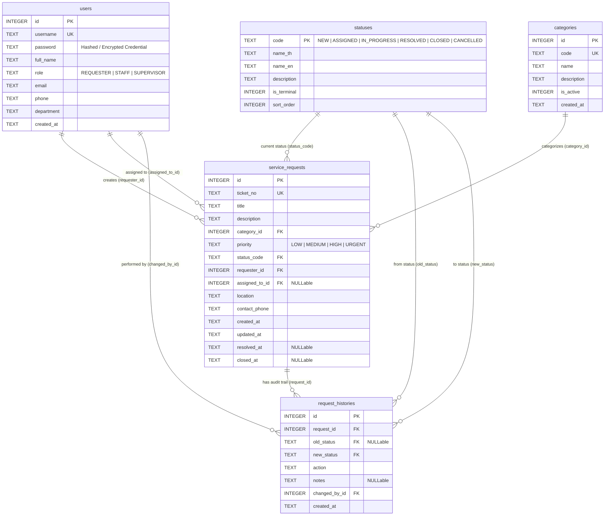

# เอกสารการออกแบบฐานข้อมูล (DATABASE.md)
## ระบบแจ้งและติดตามปัญหาด้านเทคโนโลยีสารสนเทศ (IT Service Request System)

---

## 1. ภาพรวมการออกแบบฐานข้อมูล (Database Design Overview)
ฐานข้อมูลได้รับการออกแบบตามหลักการ **Relational Database Model (3rd Normal Form - 3NF)** เพื่อรองรับความต้องการของระบบแจ้งปัญหาและติดตามสถานะไอทีของมหาวิทยาลัย โดยมีตารางหลักครบถ้วนตามข้อกำหนด ได้แก่ **User, Service Request, Category, Status, และ RequestHistory** พร้อมฟังก์ชันยืนยันตัวตน (Authentication)

---

## 2. แผนภาพความสัมพันธ์ของข้อมูล (Entity-Relationship Diagram: ERD)



---

## 3. พจนานุกรมข้อมูล (Data Dictionary)

### 3.1 ตาราง `users` (ข้อมูลผู้ใช้งานระบบ)
เก็บข้อมูลผู้ใช้งานระบบทั้งหมด ทั้งผู้แจ้งปัญหา (Requester), เจ้าหน้าที่ดำเนินงาน (Staff), และหัวหน้างาน (Supervisor)

| Field Name | Data Type | PK/FK | Nullable | Description / Constraint |
| :--- | :--- | :---: | :---: | :--- |
| `id` | INTEGER | **PK** | NO | รหัสประจำตัวผู้ใช้ (Auto Increment) |
| `username` | TEXT | **UK** | NO | ชื่อผู้ใช้สำหรับล็อกอิน (Unique) |
| `password_hash` | TEXT | - | NO | รหัสผ่านที่ผ่านการแฮชด้วย PBKDF2 (SHA-256, 10,000 rounds) |
| `password_salt` | TEXT | - | NO | ค่า Salt สุ่มทางวิทยาการรหัสลับสำหรับป้องกัน Rainbow Table |
| `full_name` | TEXT | - | NO | ชื่อ-นามสกุลภาษาไทย |
| `role` | TEXT | - | NO | บทบาท (`REQUESTER`, `STAFF`, `SUPERVISOR`) |
| `email` | TEXT | - | NO | อีเมลของมหาวิทยาลัย (Unique) |
| `phone` | TEXT | - | YES | หมายเลขโทรศัพท์ติดต่อ |
| `department` | TEXT | - | YES | คณะ / หน่วยงาน / สำนักวิชา |
| `created_at` | TEXT | - | NO | วันที่สร้างบัญชี (ISO8601 UTC) |

---

### 3.2 ตาราง `categories` (หมวดหมู่ปัญหาบริการไอที)
เก็บหมวดหมู่ของปัญหาด้านเทคโนโลยีสารสนเทศ

| Field Name | Data Type | PK/FK | Nullable | Description / Constraint |
| :--- | :--- | :---: | :---: | :--- |
| `id` | INTEGER | **PK** | NO | รหัสหมวดหมู่ (Auto Increment) |
| `code` | TEXT | **UK** | NO | รหัสย่อหมวดหมู่ เช่น `NET`, `HW`, `SW` |
| `name` | TEXT | - | NO | ชื่อหมวดหมู่ภาษาไทย |
| `description` | TEXT | - | YES | คำอธิบายหมวดหมู่และตัวอย่างปัญหา |
| `is_active` | INTEGER | - | NO | สถานะเปิดใช้งาน (1 = ใช้งาน, 0 = ปิด) |
| `created_at` | TEXT | - | NO | วันที่สร้างรายการ (ISO8601 UTC) |

---

### 3.3 ตาราง `statuses` (สถานะคำร้อง)
เก็บสถานะการดำเนินงานของคำร้องตาม Business Requirements ครบทั้ง 6 สถานะ

| Field Name | Data Type | PK/FK | Nullable | Description / Constraint |
| :--- | :--- | :---: | :---: | :--- |
| `code` | TEXT | **PK** | NO | รหัสสถานะ (`NEW`, `ASSIGNED`, `IN_PROGRESS`, `RESOLVED`, `CLOSED`, `CANCELLED`) |
| `name_th` | TEXT | - | NO | ชื่อสถานะภาษาไทย |
| `name_en` | TEXT | - | NO | ชื่อสถานะภาษาอังกฤษ |
| `description` | TEXT | - | YES | คำอธิบายความหมายของสถานะ |
| `is_terminal` | INTEGER | - | NO | สถานะสิ้นสุดหรือไม่ (1 = สิ้นสุด เช่น CLOSED/CANCELLED) |
| `sort_order` | INTEGER | - | NO | ลำดับการแสดงผลในกระบวนการทำงาน |

---

### 3.4 ตาราง `service_requests` (ข้อมูลคำร้องแจ้งปัญหา)
ตารางหลักสำหรับเก็บข้อมูลคำร้องแจ้งปัญหาและติดตามสถานะ

| Field Name | Data Type | PK/FK | Nullable | Description / Constraint |
| :--- | :--- | :---: | :---: | :--- |
| `id` | INTEGER | **PK** | NO | รหัสคำร้อง (Auto Increment) |
| `ticket_no` | TEXT | **UK** | NO | เลขที่คำร้อง เช่น `REQ-2026-0001` (Unique) |
| `title` | TEXT | - | NO | หัวข้อปัญหา (5-150 ตัวอักษร) |
| `description` | TEXT | - | NO | รายละเอียดของปัญหา |
| `category_id` | INTEGER | **FK** | NO | อ้างอิงไปยัง `categories.id` |
| `priority` | TEXT | - | NO | ระดับความสำคัญ (`LOW`, `MEDIUM`, `HIGH`, `URGENT`) |
| `status_code` | TEXT | **FK** | NO | อ้างอิงไปยัง `statuses.code` (Default: `NEW`) |
| `requester_id` | INTEGER | **FK** | NO | อ้างอิงไปยัง `users.id` (ผู้แจ้งปัญหา) |
| `assigned_to_id` | INTEGER | **FK** | YES | อ้างอิงไปยัง `users.id` (เจ้าหน้าที่ผู้รับผิดชอบ) |
| `location` | TEXT | - | YES | สถานที่เกิดปัญหา เช่น อาคารเรียนรวม 1 ห้อง 302 |
| `contact_phone`| TEXT | - | YES | เบอร์โทรศัพท์ติดต่อกลับ |
| `created_at` | TEXT | - | NO | วันเวลาที่สร้างคำร้อง |
| `updated_at` | TEXT | - | NO | วันเวลาที่มีการอัปเดตล่าสุด |
| `resolved_at` | TEXT | - | YES | วันเวลาที่แก้ไขปัญหาเสร็จสิ้น |
| `closed_at` | TEXT | - | YES | วันเวลาที่ปิดงานคำร้อง |

---

### 3.5 ตาราง `request_histories` (ประวัติการเปลี่ยนสถานะและการดำเนินงาน)
เก็บบันทึก Audit Trail ทุกครั้งที่มีการเปลี่ยนสถานะ หรือบันทึกหมายเหตุการดำเนินงาน

| Field Name | Data Type | PK/FK | Nullable | Description / Constraint |
| :--- | :--- | :---: | :---: | :--- |
| `id` | INTEGER | **PK** | NO | รหัสประวัติ (Auto Increment) |
| `request_id` | INTEGER | **FK** | NO | อ้างอิงไปยัง `service_requests.id` (ON DELETE CASCADE) |
| `old_status` | TEXT | **FK** | YES | สถานะเดิม (Null เมื่อเพิ่งสร้างคำร้องใหม่) |
| `new_status` | TEXT | **FK** | NO | สถานะใหม่ที่เปลี่ยนไป |
| `action` | TEXT | - | NO | การกระทำ เช่น `CREATE`, `ASSIGN`, `STATUS_CHANGE`, `CANCEL` |
| `notes` | TEXT | - | YES | หมายเหตุการดำเนินงาน / วิธีแก้ไขปัญหา (Work Notes) |
| `changed_by_id`| INTEGER | **FK** | NO | ผู้ทำรายการ อ้างอิงไปยัง `users.id` |
| `created_at` | TEXT | - | NO | วันเวลาที่บันทึกประวัติ (ISO8601 UTC) |

---

## 4. ความสัมพันธ์ของตาราง (Relationships & Integrity Constraints)

1. **`categories` (1) ───< (N) `service_requests`**:
   - `service_requests.category_id` อ้างอิงถึง `categories.id` (`ON DELETE RESTRICT`)
2. **`statuses` (1) ───< (N) `service_requests`**:
   - `service_requests.status_code` อ้างอิงถึง `statuses.code` (`ON DELETE RESTRICT`)
3. **`users` (1) ───< (N) `service_requests` (Requester)**:
   - `service_requests.requester_id` อ้างอิงถึง `users.id` (`ON DELETE RESTRICT`)
4. **`users` (1) ───< (N) `service_requests` (Assigned Staff)**:
   - `service_requests.assigned_to_id` อ้างอิงถึง `users.id` (`ON DELETE SET NULL`)
5. **`service_requests` (1) ───< (N) `request_histories`**:
   - `request_histories.request_id` อ้างอิงถึง `service_requests.id` (`ON DELETE CASCADE`)
6. **`users` (1) ───< (N) `request_histories`**:
   - `request_histories.changed_by_id` อ้างอิงถึง `users.id` (`ON DELETE RESTRICT`)

---

## 5. คำสั่ง SQL สำคัญตามโจทย์ (Required SQL Queries)

### 📌 SQL 1: ค้นหาคำร้องที่มีสถานะ 'NEW' (Pending Assignment)
ค้นหารายการคำร้องใหม่ที่ยังไม่ได้รับการมอบหมายงาน เรียงลำดับตามความเร่งด่วน (Priority) และวันที่แจ้ง เพื่อให้ Supervisor นำไปมอบหมายงานได้อย่างสะดวกรวดเร็ว

```sql
SELECT 
    r.id AS request_id,
    r.ticket_no,
    r.title,
    c.name AS category_name,
    r.priority,
    r.status_code AS status,
    u.full_name AS requester_name,
    u.department AS requester_dept,
    r.location,
    r.contact_phone,
    r.created_at
FROM service_requests r
JOIN categories c ON r.category_id = c.id
JOIN users u ON r.requester_id = u.id
WHERE r.status_code = 'NEW'
ORDER BY 
    CASE r.priority 
        WHEN 'URGENT' THEN 1 
        WHEN 'HIGH' THEN 2 
        WHEN 'MEDIUM' THEN 3 
        WHEN 'LOW' THEN 4 
    END, 
    r.created_at ASC;
```

---

### 📌 SQL 2: แสดงคำร้องแยกตาม Category (Breakdown & Aggregation)
แสดงสถิติและภาพรวมคำร้องแยกตามแต่ละหมวดหมู่ปัญหา พร้อมนับจำนวนรวมและจำแนกตามสถานะสำคัญ เพื่อใช้ในการวิเคราะห์ปัญหาที่พบบ่อยในมหาวิทยาลัย

```sql
SELECT 
    c.id AS category_id,
    c.name AS category_name,
    COUNT(r.id) AS total_requests,
    SUM(CASE WHEN r.status_code = 'NEW' THEN 1 ELSE 0 END) AS count_new,
    SUM(CASE WHEN r.status_code = 'ASSIGNED' THEN 1 ELSE 0 END) AS count_assigned,
    SUM(CASE WHEN r.status_code = 'IN_PROGRESS' THEN 1 ELSE 0 END) AS count_in_progress,
    SUM(CASE WHEN r.status_code = 'RESOLVED' THEN 1 ELSE 0 END) AS count_resolved,
    SUM(CASE WHEN r.status_code = 'CLOSED' THEN 1 ELSE 0 END) AS count_closed,
    SUM(CASE WHEN r.status_code = 'CANCELLED' THEN 1 ELSE 0 END) AS count_cancelled
FROM categories c
LEFT JOIN service_requests r ON c.id = r.category_id
GROUP BY c.id, c.name
ORDER BY total_requests DESC, c.id ASC;
```

---

### 📌 SQL 3: เพิ่มชื่อเจ้าหน้าที่จากคำร้องรับผิดชอบจากมากไปน้อย (Staff Workload Ranking)
แสดงรายชื่อเจ้าหน้าที่ไอทีทั้งหมด (`role = 'STAFF'`) พร้อมสรุปจำนวนคำร้องที่ได้รับมอบหมาย โดยเรียงลำดับจาก **เจ้าหน้าที่ที่มีคำร้องรับผิดชอบมากที่สุดไปหาน้อยที่สุด (DESC)** เพื่อช่วยให้หัวหน้างานกระจายภาระงานได้อย่างสมดุล (Workload Balancing)

```sql
SELECT 
    u.id AS staff_id,
    u.full_name AS staff_name,
    u.email AS staff_email,
    u.department AS staff_dept,
    COUNT(r.id) AS total_assigned_requests,
    SUM(CASE WHEN r.status_code = 'ASSIGNED' THEN 1 ELSE 0 END) AS count_assigned,
    SUM(CASE WHEN r.status_code = 'IN_PROGRESS' THEN 1 ELSE 0 END) AS count_in_progress,
    SUM(CASE WHEN r.status_code = 'RESOLVED' THEN 1 ELSE 0 END) AS count_resolved,
    SUM(CASE WHEN r.status_code = 'CLOSED' THEN 1 ELSE 0 END) AS count_closed
FROM users u
LEFT JOIN service_requests r ON u.id = r.assigned_to_id
WHERE u.role = 'STAFF'
GROUP BY u.id, u.full_name, u.email, u.department
ORDER BY total_assigned_requests DESC, u.id ASC;
```
